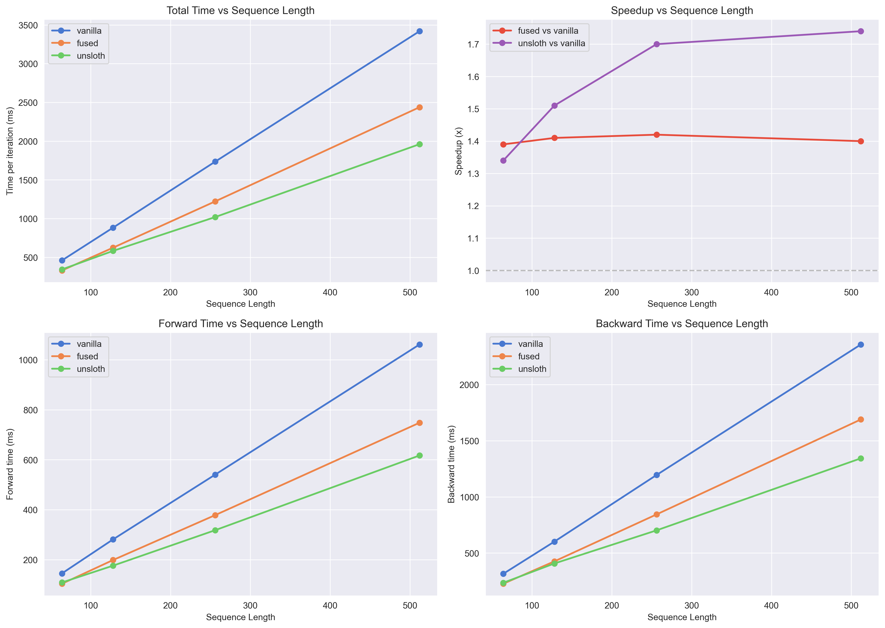

# Benchmarking Unsloth's Fused LoRA Kernels

I wanted to understand exactly how much speedup comes from [Unsloth's](https://github.com/unslothai/unsloth) fused MLP kernels. So I built a minimal benchmark to isolate the MLP fusion benefit.

## The Experiment

I created three variants of the same model and compared their training performance:

**Vanilla PEFT** uses standard HuggingFace PEFT LoRA with gradient checkpointing.

**Fused MLP** takes vanilla PEFT and replaces just the MLP forward passes with Unsloth's fused triton kernels.

**Full Unsloth** uses Unsloth's FastLanguageModel, which applies all their optimizations: fused MLP, RoPE, RMS LayerNorm, and smart gradient checkpointing.

I ran this on an A100 80GB using Qwen2.5-3B-Instruct (which uses SwiGLU activation in its MLP blocks). The config was LoRA rank 32, batch size 32, and I tested four sequence lengths: 64, 128, 256, and 512. Each experiment ran for 100 iterations.

The training data (`sft_train.jsonl`) is from my [integralreason](https://github.com/noamshh/integralreason) repo. Also note that the fused kernel requires `lora_dropout=0` and `bias="none"`.
## Results



The speedup plot (top right) tells the story clearly. The fused MLP kernel provides a consistent **1.4x speedup**, independent of sequence lengths.

Full Unsloth starts at 1.34x faster than vanilla at short sequences (64 tokens), but scales up to **1.74x at 512 tokens**. The difference between the purple and red lines comes from Unsloth's other optimizations like fast RoPE and RMS LayerNorm. These operations scale linearly with sequence length, so their benefit becomes more visible there.

Interestingly, at 64 tokens, full Unsloth is actually slightly slower than just the fused MLP (0.96x). There's some overhead from the additional patches that only pays off at longer sequences.

## How the Fused MLP Works

To understand the optimization, I traced through the actual code that executes during training. I created a comprehensive [Excalidraw](https://github.com/excalidraw/excalidraw) diagram (`lora.excalidraw`) that visualizes exactly how Unsloth's LoRA_MLP autograd function works, check that out if you want the full picture.

### PEFT LoRA

In vanilla PEFT (from `peft/tuners/lora/layer.py::Linear.forward`), each LoRA-adapted linear layer does this:

```python
result = base_layer(x)                      # X @ W
result += lora_B(lora_A(x)) * scaling       # + ((X @ A) @ B) * scaling
```

For a complete MLP layer with gate, up, and down projections, this expands to:

```python
# gate 
e = X @ gate_W                              # base projection
e += (X @ gate_A) @ gate_B * scaling        # LoRA adapter

# up
g = X @ up_W
g += (X @ up_A) @ up_B * scaling

# activation
f = silu(e)                                 # sigmoid(e) * e
h = f * g

# down
output = h @ down_W
output += (h @ down_A) @ down_B * scaling

# total: 9 matmuls + 3 activation ops = 12 kernel launches per MLP layer
```

Each of these operations is a separate CUDA kernel call. There's no fusion, just standard PyTorch dispatching.

### Unsloth Fused MLP

Unsloth's implementation (from `unsloth/kernels/fast_lora.py`) wraps everything in a single autograd function:

```python
class LoRA_MLP(torch.autograd.Function):
    @staticmethod
    def forward(ctx, X, gateW, gateA, gateB, gateS, upW, upA, upB, upS,
                downW, downA, downB, downS):
        # fused matmul: out = X @ W; out.addmm_(X @ A, B, alpha=S)
        e = matmul_lora(X, gateW, gateA, gateB, gateS)
        g = matmul_lora(X, upW, upA, upB, upS)

        # triton kernel: fuses swish(e) * g in single pass
        h = swiglu_fg_kernel(e, g)

        i = matmul_lora(h, downW, downA, downB, downS)
        return i
```

The key optimization in `matmul_lora` (from `unsloth/kernels/utils.py`) is using PyTorch's `addmm_` to fuse the base and LoRA computations:

```python
out = torch.matmul(X, W, out=out)           # X @ W
if A is not None:
    out.addmm_(X @ A, B, alpha=scaling)     # out += (X @ A) @ B * scaling
```

This is still 9 matmuls total, but `addmm_` fuses the matmul and add operations together. The real gain comes from the triton SwiGLU kernel, which computes `f = silu(e) * g` in a single GPU kernel instead of three separate PyTorch operations.

Note that the mathematical computation is the same, but memory access is optimized and fewer kernels are launched.

## Full Unsloth

Unsloth falls back to PyTorch's built-in `scaled_dot_product_attention` when Flash Attention isn't available. This is the same SDPA that vanilla PEFT uses, so there's no attention optimization happening in my setup.

So where does the speedup comes from?

Here is what Unsloth adds on top of the fused MLP:

**Fast RoPE** uses a custom triton kernel (`fast_rope_embedding`) to compute rotary position embeddings for query and key vectors. This runs on all tokens in each layer's attention block, so it scales linearly with sequence length.

**Fast RMS LayerNorm** replaces PyTorch's normalization with a triton kernel (`_rms_layernorm_forward`) that fuses the variance calculation, rsqrt, normalization, and weight multiplication into one operation. This also runs on every token, so it scales with sequence length.

**Smart gradient checkpointing** uses Unsloth's custom checkpointing instead of PyTorch's default. I didn't measure this separately, but it likely contributes to the speedup.

These optimizations explain why the full Unsloth speedup grows from 1.34x to 1.74x as sequence length increases.
If Flash Attention were available, I'd expect even bigger gains at long sequences, since attention scales quadratically with sequence length. But even without it, the combination of fused MLP plus optimized RoPE and LayerNorm gives a solid 1.7x speedup.

## Project Structure

I built this as a minimal reproducible benchmark:

- **`fused_mlp/`** contains standalone triton kernels extracted from Unsloth (`swiglu.py`, `fast_lora.py`, `utils.py`). I had to do this because importing from Unsloth triggers their automatic monkey-patching of `transformers` and `peft`

- **`models.py`** defines the three model variants, each using the same base model and LoRA config

- **`lora_bench.py`** is the benchmark entrypoint

- **`trainer.py`** implements the training loop with CUDA event timings

Results are in `results.json`, plots in `benchmark_results.png`, and `lora.excalidraw` contains a detailed walkthrough
of the Unsloth LoRA_MLP code.
